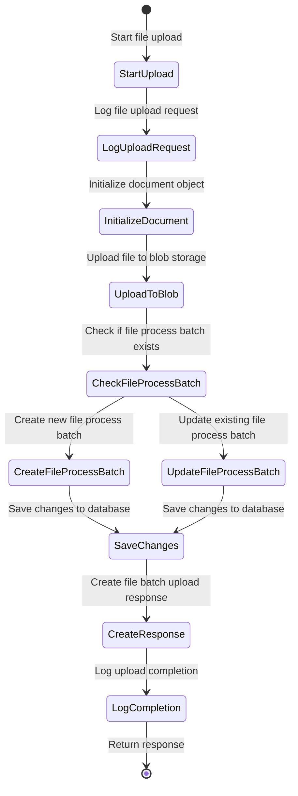
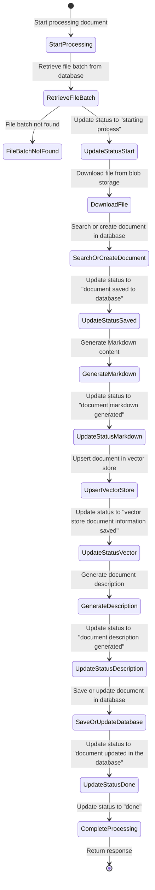

# Overview of the Solution functionallity

## Upload Document

When a new document is uploaded, the document is processed and marked ready to process. The `/filebatch/upload` endpoint in the `.\src\ChatWYData.DocumentsApi\EndPoints\FileBatchEndpoints.cs` file handles the uploading of files and their processing for storage and further operations. Here is a high-level overview of its functionality:

- Document Initialization. Creates a new Document object with the file name and content type from the upload request.
- Upload the file to Azure Blob Storage.
  - Checks if the file already exists in the blob storage and updates it if necessary.
- Update Process Batch Queue. Checks if a FileProcessBatch entry already exists for the file.
- Saves the changes to the database.
- Return Response

## Process an Uploaded Document

The `/filebatch/processdoc` endpoint in the `.\src\ChatWYData.DocumentsApi\EndPoints\FileBatchEndpoints.cs` file handles the processing of uploaded documents.

Here is a high-level overview of its functionality:

- Retrieve File Batch from Database. Fetches the FileProcessBatch entry for the given file name from the database.
- Download File from Blob Storage. Retrieves the file content from Azure Blob Storage using the Blob URI.
- Search or Create Document in Database
- Generate Markdown Content
    - Converts the file content to Markdown using the MarkdownApiService.
    - Updates the document with the generated Markdown content.
    - ***Important:** in Windows development, the app uses the `ChatWYData.MarkDown.MarkitdownCSnakes` project to generate the markdown content. When the app is running on Linux (like when deployed to Azure)m the app uses `ChatWYData.MarkDown.MarkitdownBashApi` to generate the markdown content.*
- Upsert Document in Vector Store. Adds the document to the vector store using the VectorStoreApiService.
- Generate Document Description. Generates a description for the document using the DescriptionApiService.
- Update Database with Document Information
- Complete Processing. Returns the response object.

This endpoint ensures that documents are processed, converted to Markdown, added to the vector store, described, and updated in the database, providing a comprehensive workflow for document management.

## Chat steps for each question

Each conversation in the Chat App:

- Initialize Response
  - Generate a query for Azure AI Search.
  - Generate an embedding for the search query.
- Search
  - Define search options like maximum results and vector property name.
  - Execute a vectorized search on the document collection.
  - Filter and collect documents based on the minimum score.
- Generate Response Message:
  - If documents are found, generate a friendly response message.
  - If no documents are found, generate a response from the user's query.
- Return Response